# 沐阳教育课程

## 
以下所有课程均享受的福利

    1. 0基础均可以学习,会有一整套量身定制的学习路线。只要你有兴趣
    2. 实战内容很多,均是市面比较流行的app
    3. 永久更新有问必答
    4. 永久星球赠送
    5. 附赠爬虫学习路线(本人学习的)
    6. 专属学员群,发单接单内推均有.学习氛围浓厚友好交流.

## 
价格介绍

1. 安卓：2999元
2. iOS：1999元
3. JS：1999元

1. ​	

## 1.从0到1学习安卓逆向

1. 每集大概20-30分钟.思维导图代表课程目录。学习时长自己判断哦

### 课程目录

## 2.从0到1学习iOS逆向

1. 每集大概20-30分钟.思维导图代表课程目录。学习时长自己判断哦

### 课程目录

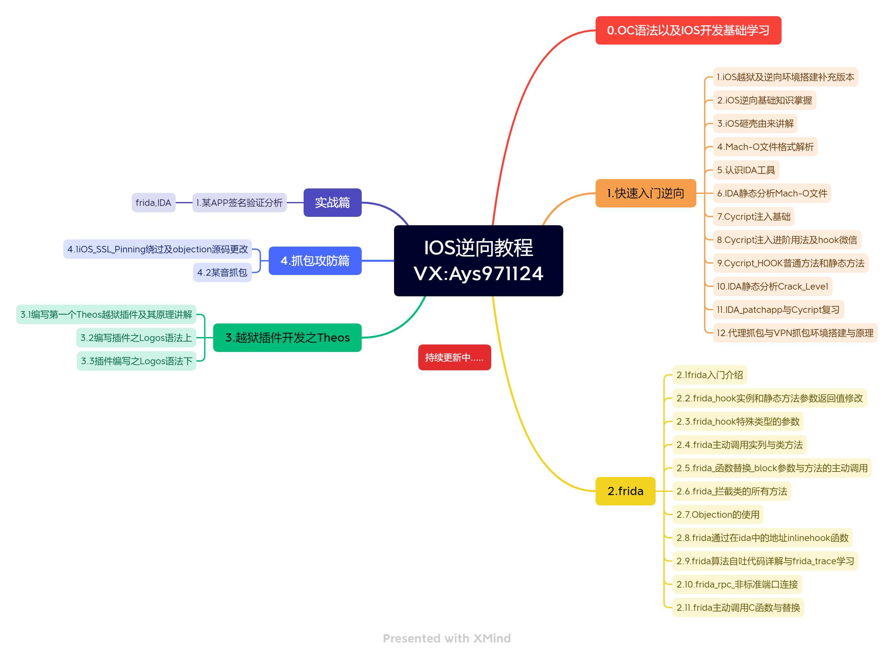

## 3.JS逆向

### 课程目录

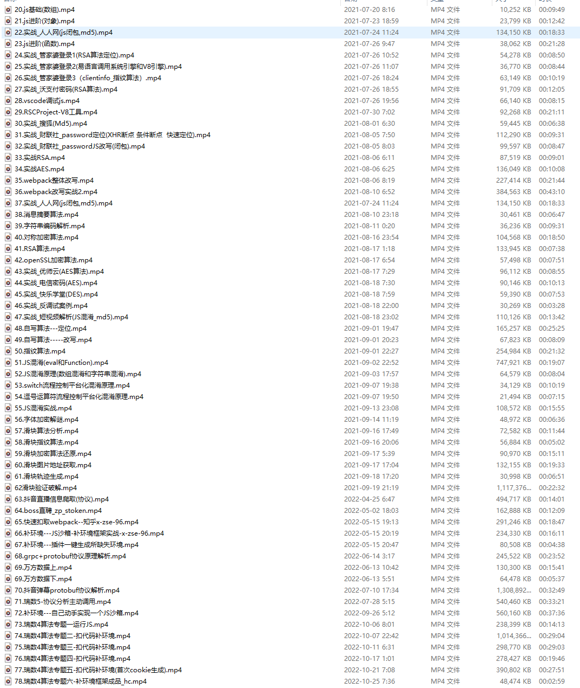

## 4.学员评价

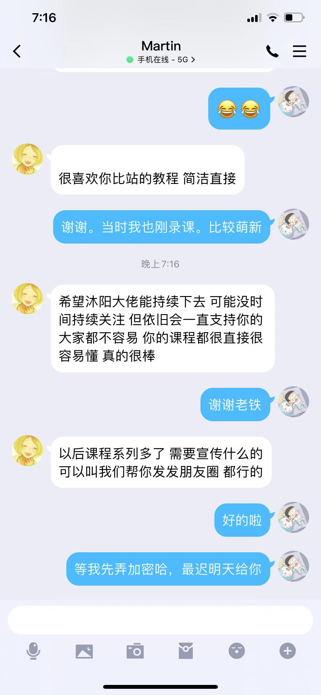

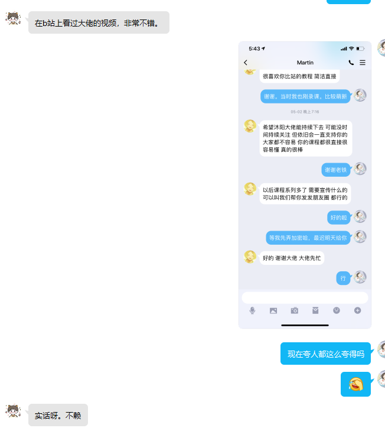

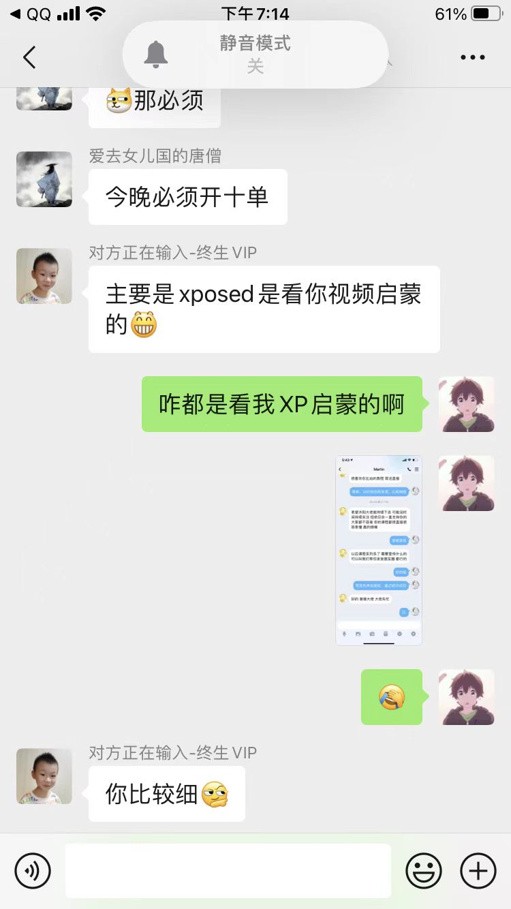

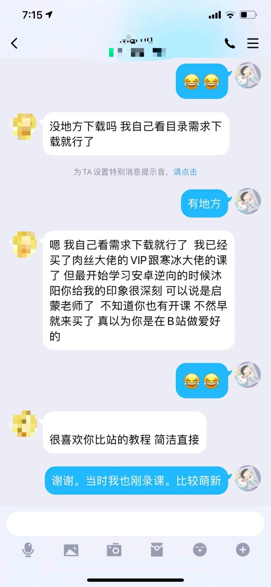

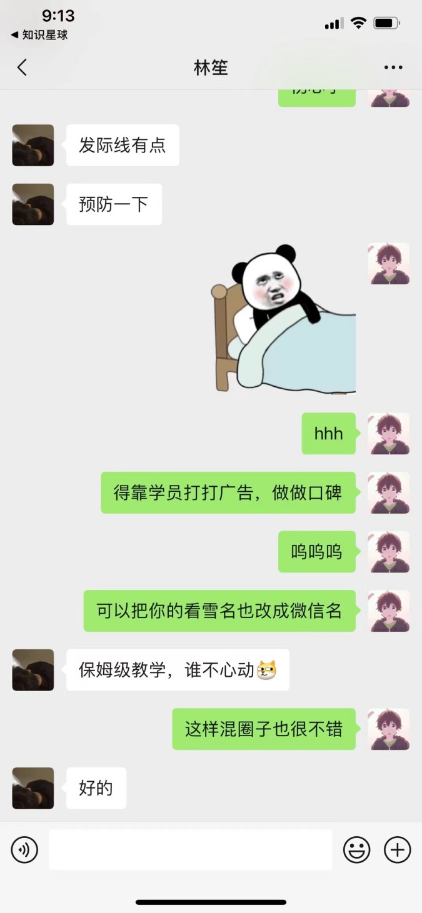

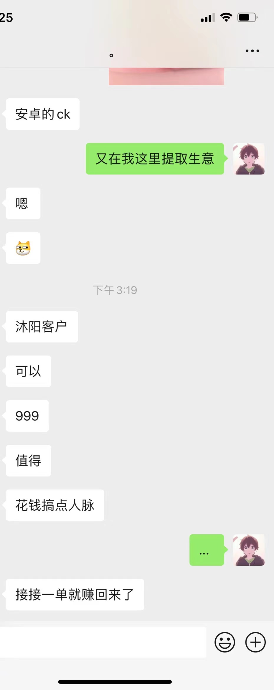

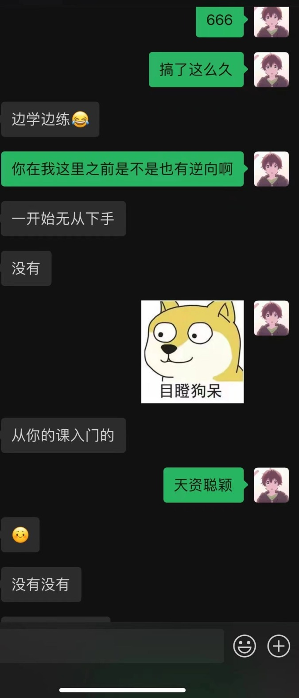

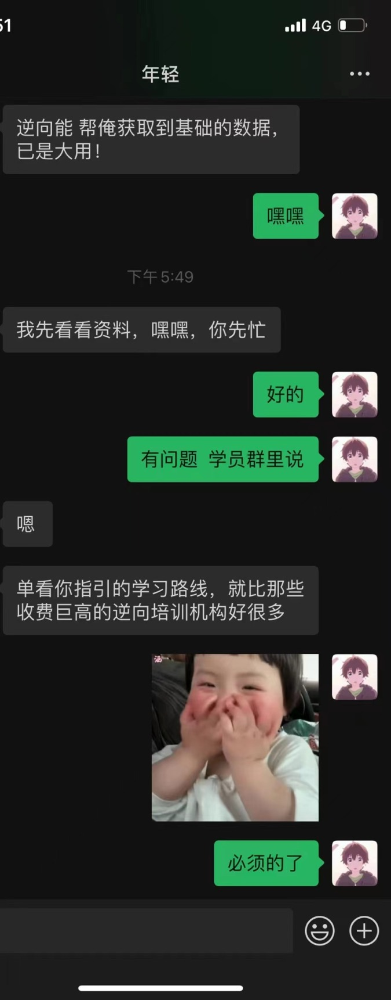

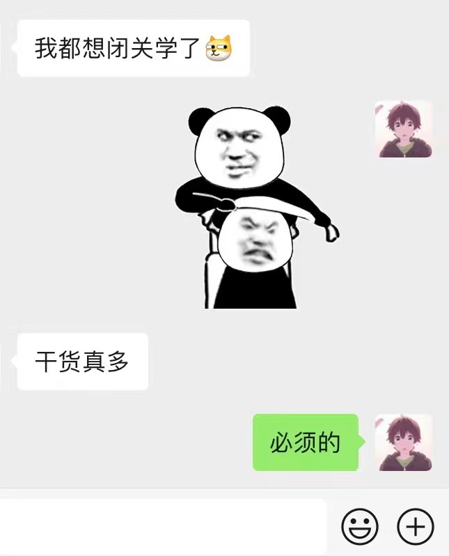

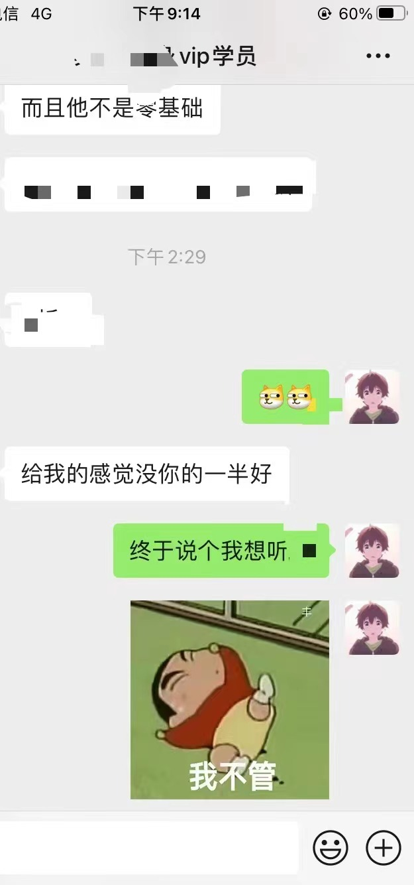

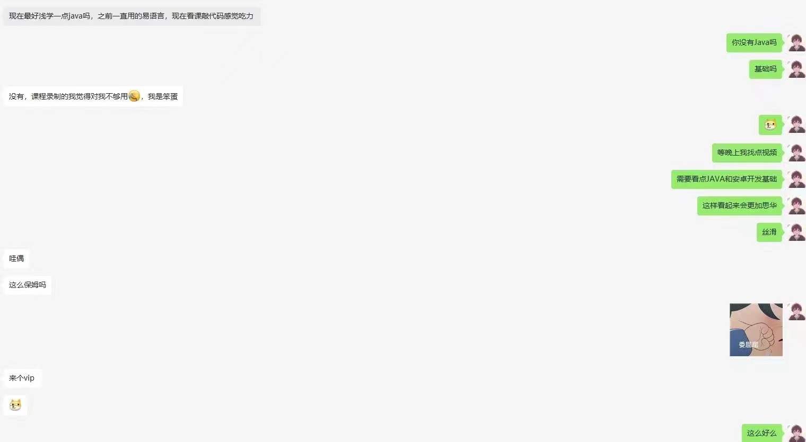

