# 沐阳逆向教育 - 安卓/iOS逆向实战课程

> 从看不懂一行汇编，到独立还原大厂APP的加密算法

**安卓 + iOS 双平台全覆盖 · 开课至今每月不断更 · 真实APP案例驱动 · 学员已内推入职大厂**

---

## 关于讲师

沐阳，专注移动安全逆向领域多年，深耕安卓与iOS双平台逆向技术。

- B站持续输出逆向技术公开课，累计播放量数十万
- 课程覆盖 Frida / IDA Pro / OLLVM / eBPF / Flutter / Swift 等主流技术栈
- 已帮助多名学员成功入职安全公司、互联网大厂安全部门

> 不卖焦虑，只教能落地的技术。

---

## 为什么是「每月更新」？

逆向是一门技术迭代极快的手艺——APP 版本一更，加密就变，两年前的教程往往已经打不开今天的样本。

这套课从 2024 年开课至今**保持每月更新**，紧跟最新版 APP 和最新对抗手段。业内极少有逆向课能做到从不断更。你付一次费，学到的永远是还能用的技术，而不是过时的老套路。

一次付费，永久更新。

---

## 你是不是也有这些困扰？

- 想入行逆向安全，网上资料太散，不知道从哪开始
- 自学效率低，一个问题卡好几天，没人能问
- 看了一堆教程，真上手还是不会
- 怕学完找不到工作，钱白花了

这套课程就是为了解决这些问题。

**想了解详情？加微信聊：Ays971124**

---

## 课程介绍

### 安卓逆向课程 - 2999元

**适合**：零基础 / Java开发转型 / 安全从业者想进阶

**你将掌握**：
- Hook框架：Frida、LSPosed开发与实战
- 脱壳与加固：企业壳分析、反调试对抗
- SO层逆向：ARM汇编、IDA Pro、算法还原
- 高级技术：OLLVM反混淆、白盒AES、eBPF
- 专项突破：Flutter逆向、Protobuf分析

点击查看完整课程大纲

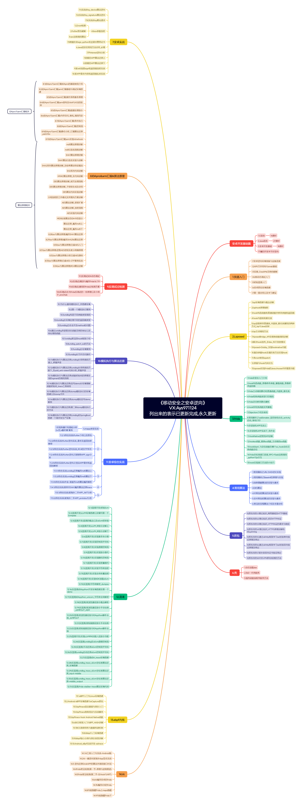

---

### iOS逆向课程 - 2999元

**适合**：零基础 / iOS开发转型 / 安全研究员

**你将掌握**：
- 越狱环境：有根/无根越狱、Theos插件开发
- 动态分析：Frida Hook、内存漫游、RPC调用
- 静态分析：ARM汇编、IDA Pro、算法还原
- 高级技术：Swift逆向、白盒AES、Chomper模拟执行
- 工具开发：AI逆向助手、巨魔APP开发

点击查看完整课程大纲

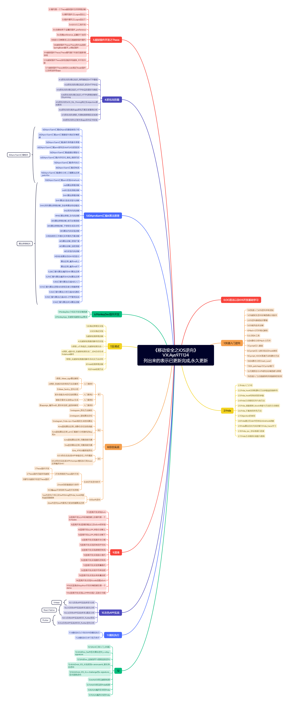

---

### 双课套餐 - 5398元（原价 5998，立省 600）

安卓 + iOS 一起报，打通双平台逆向能力，比单报省 600。名额和优惠详情加微信咨询。

---

## 更新记录

课程保持每月更新，紧跟行业技术动态。完整记录见 [CHANGELOG.md](CHANGELOG.md)。

最近更新（2026年9月）：

安卓新增：

- 14.8 内核隐藏Frida上maps隐藏
- 14.9 内核隐藏Frida下

安卓（2026年8月）：

- 14.4 frida常见检测(第一节-原理与进程痕迹)
- 14.5 frida常见检测(第二节-反Hook与ART)
- 14.6 Ai魔改安卓的frida
- 14.7 Ai魔改iOS的frida

iOS（2026年8月）：

- 12.6(Ai)iOS常见越狱检测
- 12.7(Ai)iOS常见的frida检测
- 12.8(Ai)Ai魔改安卓的frida
- 12.9(Ai)Ai魔改iOS的frida

安卓基础第一章重置为新版本（2026年5月）：

- 1.1 安卓逆向环境准备与设备连接
- 1.2 APK文件结构与smali基础
- 1.3 实操_CrackMe注册码破解
- 1.4 JEB动态调试入门
- 1.5 初始混淆入门
- 1.6 安卓抓包环境搭建
- 1.7 第一章总结以及学习建议

iOS（2026年5月）：

- 1.0(快速入门)iOS逆向学前须知

更早的更新（2026年3月及以前）见 [CHANGELOG.md](CHANGELOG.md)。

---

## 学完能干什么？

- 独立完成APP协议分析与算法还原
- 胜任安全公司逆向工程师岗位
- 打CTF移动安全方向没问题
- 自己写安全工具和插件

**就业方向**：移动安全工程师 / 逆向分析师 / 安全研究员 / 爬虫工程师

---

## 为什么选这套课？

| 优势 | 说明 |
|------|------|
| 系统化体系 | 从环境搭建到高级对抗，完整学习路线，不是东拼西凑的碎片 |
| 实战驱动 | 全是真实APP案例，学完直接能干活 |
| 有问必答 | 群里问问题随时回，不让你卡着 |
| 就业内推 | 学员专属内推渠道，合作企业包括安全公司、互联网大厂 |
| 知识星球 | 赠送永久会员，额外学习资料 |
| 分期付款 | 花呗、信用卡分期都支持 |

---

## 学员评价

> 以下为部分学员真实反馈，更多评价可展开查看。

点击查看学员评价截图

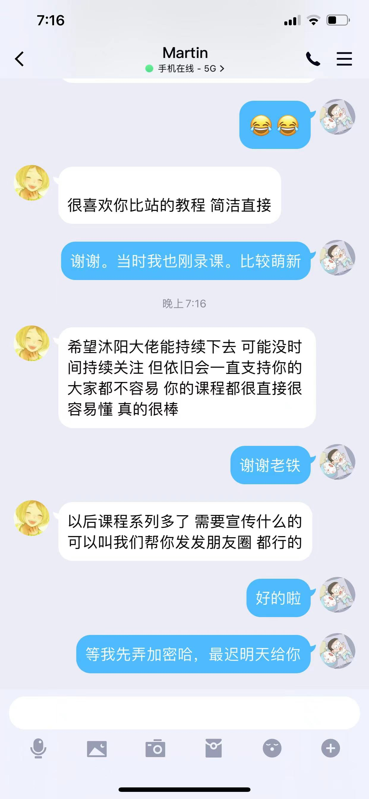
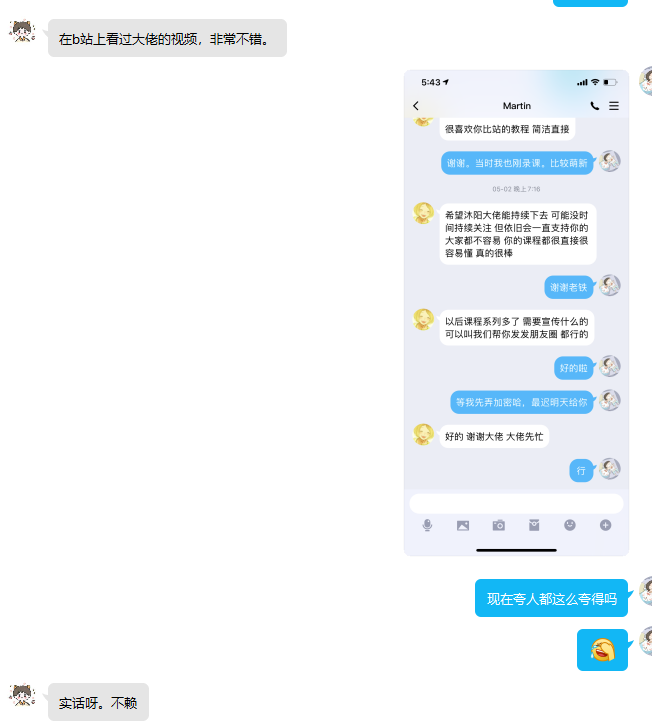
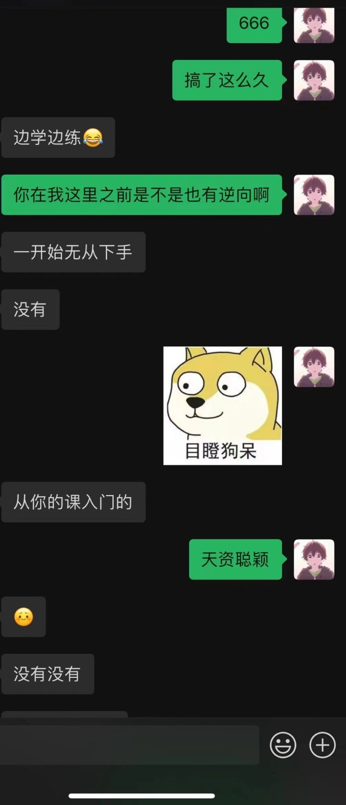
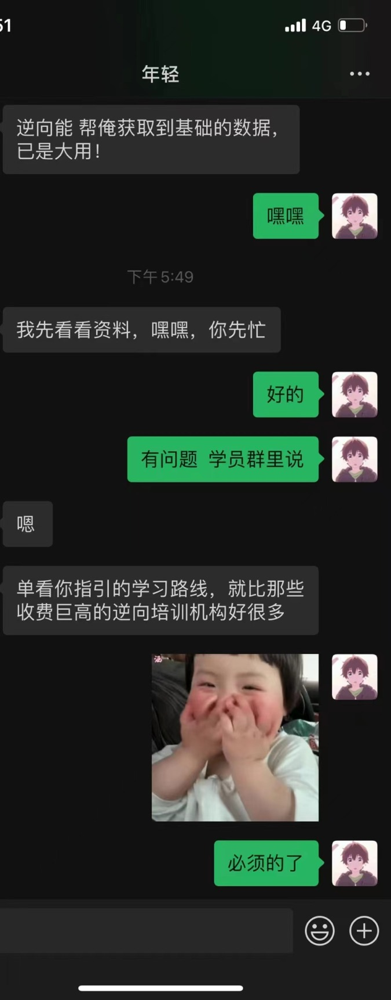
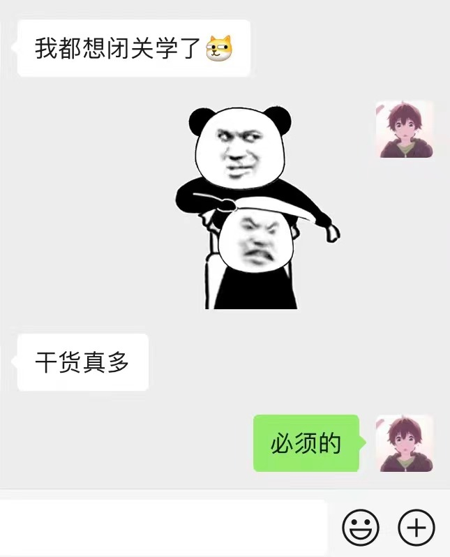
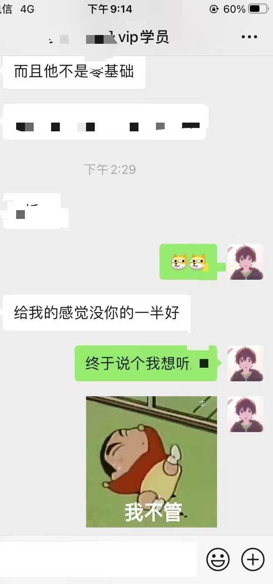
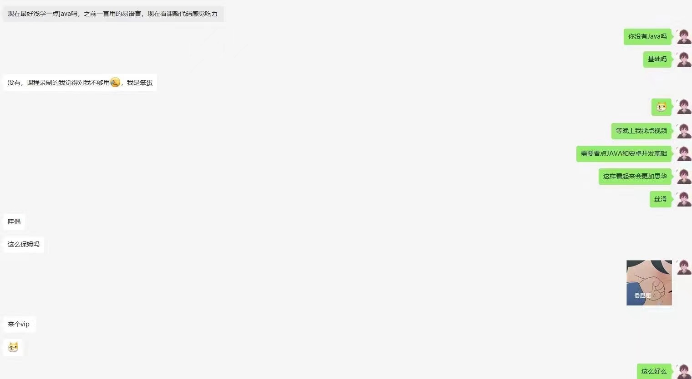
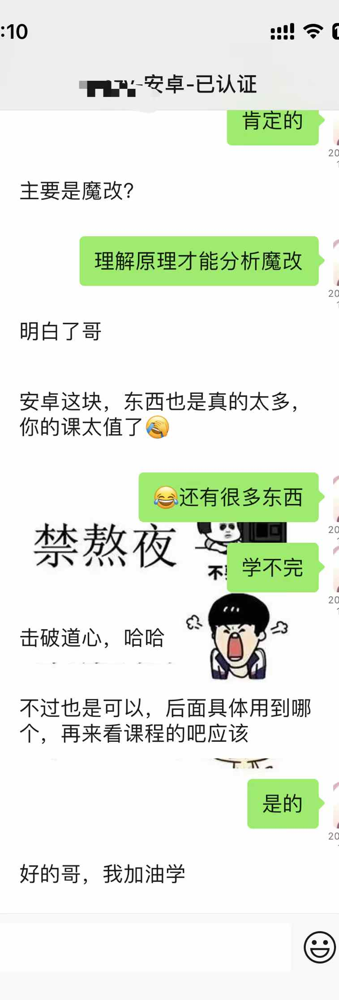
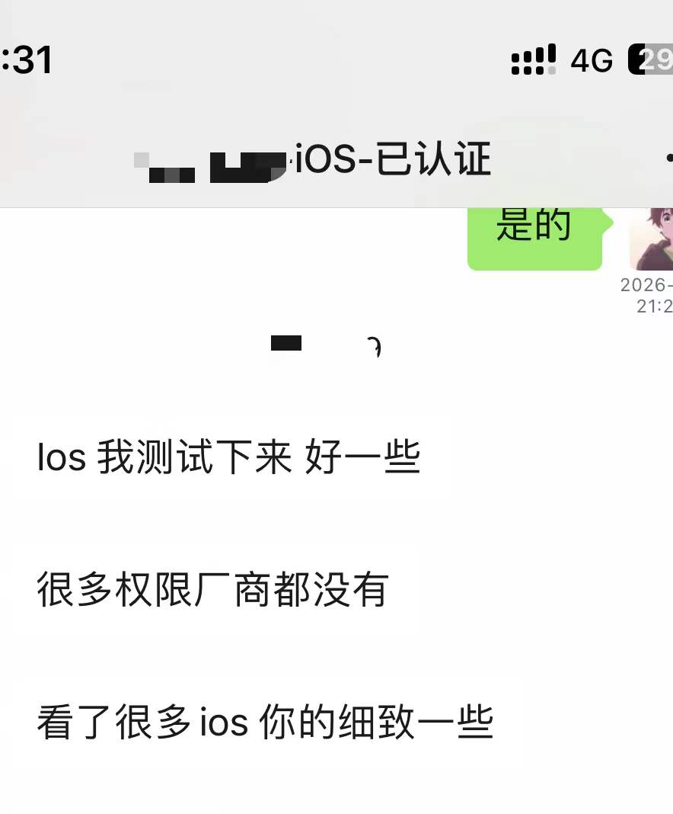

---

## 学员内推

跟多家企业有内推合作，学员优先推荐：

- 安全公司逆向岗
- 互联网大厂安全部门
- 数据相关岗位

具体看 [内推专区](内推专区/文字描述区.md)

---

## 联系方式

| 渠道 | 信息 |
|------|------|
| 微信 | Ays971124 |
| B站 | https://space.bilibili.com/439348342 |

---

**想学的加微信：Ays971124，欢迎咨询。**
