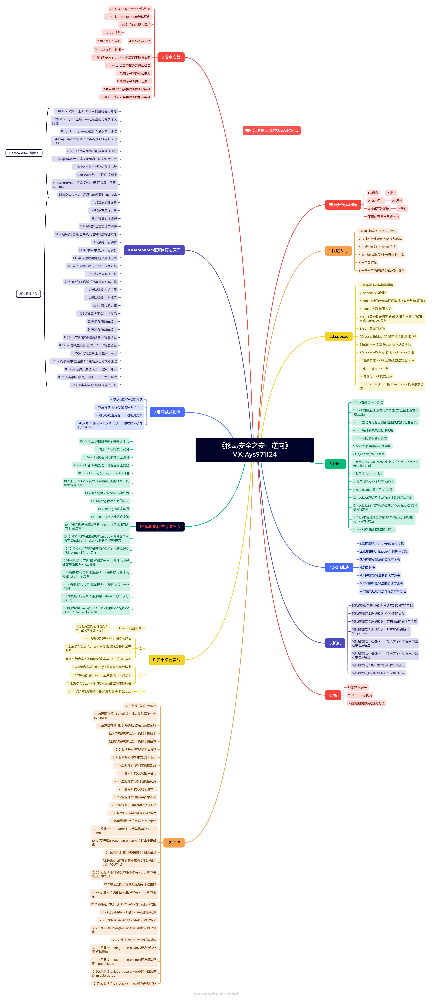

# 沐阳逆向教育课程


## <summary>以下所有课程均享受的福利</summary>

    1.图上有的表示更新完成的！！！系统学习路线，0基础小白可学
    2.课程以就业要求为基准设定更新路线。理论与实践并行
    3.赠送永久知识星球
    4.课程一次收费，永久更新
    5.有学员群圈子学习交流，内推工作等
    6.学习过程中有问必答

## <summary>价格介绍</summary>

1. 安卓：2999元
2. iOS：2999元
4. 支持花呗,信用卡分期支付

<summary>沐阳联系方式</summary>

<details>

​	VX:Ays971124

​	公开课B站地址:  https://space.bilibili.com/439348342

</details>	

## 1.移动安全之安卓逆向


1. 每集大概20-30分钟.思维导图代表课程目录。学习时长自己判断哦




## 2.移动安全之iOS逆向


1. 每集大概20-30分钟.思维导图代表课程目录。学习时长自己判断哦

### 课程目录


## 3.课程更新记录

### 2024.7月份更新记录

安卓更新记录:

新增:

2(lsposed开发)12.界面与hook代码交互

2(lsposed开发)13.lsposed实现frida的Java.choose内存搜索功能

3(frida)15.hook实现接口方法的小技巧

12.26(反混淆)unidbg自动还原ollvm控制流平坦化

12.27(反混淆)IDA_trace环境搭建

12.28(反混淆)unidbg_trace_ollvm非标准算法还原_环境搭建

12.29(反混淆)unidbg_trace_ollvm非标准算法还原_input-middle

12.30(反混淆)unidbg_trace_ollvm非标准算法还原-middle_output

12.31(反混淆)frida-stallker-trace算法环境代码


iOS更新记录:

新增:

1.13(快速入门)无根越狱和有根越狱的区别

3.7(越狱插件Theos)前部分注意事项以及无根越狱插件编写


### 2025.2月份更新记录

| 安卓逆向                                              | iOS逆向                                                |
| ----------------------------------------------------- | ------------------------------------------------------ |
|                                                       | 5.26(汇编与算法)Demo魔改md5_1-16轮还原                 |
|                                                       | 5.27(汇编与算法)Demo魔改md5_余下轮还                   |
| 8.28(so与算法原理)魔改SHA1算法还原                    | 5.28(汇编与算法)魔改SHA1算法还原                       |
| 8.29(so与算法原理)魔改SHA256算法还原                  | 5.29(汇编与算法)魔改SHA256算法还原                     |
|                                                       |                                                        |
| 8.30(so与算法原理)白盒AES入门(24.12月更新)            | 5.30(汇编与算法)白盒AES入门(24.12月更新)               |
| 8.31(so与算法原理)逆推AES密钥及差分故障原理(12月更新) | 5.31(汇编与算法)逆推AES密钥及差分故障原理(24.12月更新) |
| 8.32(so与算法原理)分析白盒AES源码.md(24.12月更新)     | 5.32(汇编与算法)分析白盒AES源码.md(24.12月更新)        |
| 8.33(so与算法原理)白盒AES-CTF案例实战(24.12月更新)    | 5.33(汇编与算法)白盒AES-CTF案例实战(24.12月更新)       |


### 2025.3月份更新记录

**iOS更新:**

3.8.Theos与frida消除SpingBoard数字_UI调试插件

3.9Theos编写基于列表页面新增按钮

> 1.新增组 在组里面添加一个控件
> 2.在原组添加一个控件
> 3.在当前页面控制器添加一个控件

3.10.按钮适配所有越狱_并开发功能

> 1.switch选择功能 && 对应的cell都需要有图片资源
> 2.插件全适配所有越狱(rootfull,rootless,roothide)
> 3.退出功能
> 4.打开新的页面,弹出UIViewController

--------------

**安卓更新**：

5.34算法之RC4讲解

8.34算法之RC4讲解

11.2.1.flutter介绍以及抓包

11.2.2.flutter逆向实战_请求及返回加密解密

11.2.3.flutter逆向之RC4样本


删除 ：5(抓包攻防)9.某违法app_flutter抓包详讲


### 2025.4月份更新记录

安卓更新

​	11.4.1(综合实战)某样本SHA1魔改算法还原trace

> 1.魔改SHA1算法还原
> 2.分析unidbg Trace日志

-------

iOS更新

​	8.3.1(综合实战)某APP参数定位_内存漫游

> 1.frida内存漫游定位方法

​	8.3.2(综合实战)某APPchomper模拟执行和trace还原魔改SHA1

> 1.使用chomper模拟执行iOS
> 2.分析chomper Trace日志。魔改SHA1算法还原

### 2025.6月份更新记录

安卓和iOS逆向更新相同

安卓在第八章   iOS在第五章  同时之前的1-10节课已经替换成下面的新版本了。

```
1(IDApro与arm汇编)IDAPro的基础使用介绍
2(IDApro与arm汇编)arm汇编基础与调试环境搭建
3(IDApro与arm汇编)操作系统基本原理
4(IDApro与arm汇编)arm架构及A64与A32的区别
5(IDApro与arm汇编)数据处理指令
6(IDApro与arm汇编)内存访问_堆栈_调用约定
7(IDApro与arm汇编)条件执行
8(IDApro与arm汇编)控制流
9(IDApro与arm汇编)静态分析_汇编算法还原_patchSo
10(IDApro与arm汇编)arm实现inlinehook
```

### 2025.7月份更新记录

iOS更新

```
3.11(越狱插件Theos)使用Xcode调试Tewak插件以及附加所有app
8.4.1(AI开发逆向助手)开发思路和Theos插件开发
8.4.2(AI开发逆向助手)hook到的数据进行保存
8.4.3(AI开发逆向助手)巨魔app开发和助手ipa的开发思路
8.5.1(swift逆向)swift逆向介绍以及SwiftString的frida_hook参数和返回值替换
8.5.2(swift逆向)swift案例之某加密器算法还原
```

### 2025.8月份更新记录

安卓更新

删除如下视频

```
9.2反调试之过root检测-企业壳
9.3编译_编译与魔改面具
9.4frida检测的原理
9.6反调试过反frida调试
9.7ubuntu虚拟机安装配置及魔改frida过检测
```

新增视频

```
9.2(反调试)编译与魔改frida16.7.19
9.3(反调试)通用的frida过检测方案
9.4(反调试)补充frida反调试的一些原理以及小例子_envChek
```

## 4.学员评价

<details>


</details>
