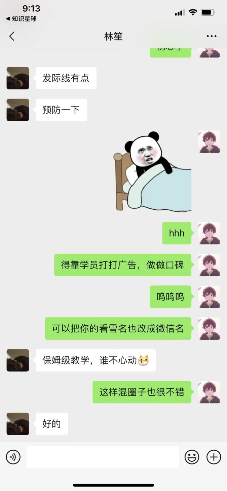
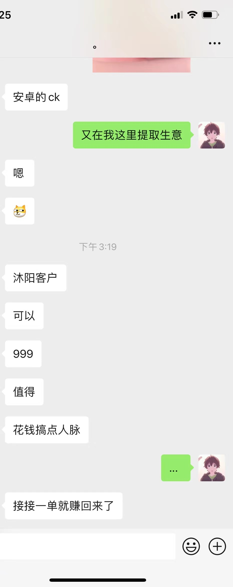

# 沐阳逆向教育 - 安卓/iOS逆向实战课程

> **从零基础到逆向工程师，系统化学习移动安全逆向技术**

---

## 你是不是也有这些困扰？

- 想入行逆向安全，网上资料太散，不知道从哪开始
- 自学效率低，一个问题卡好几天，没人能问
- 看了一堆教程，真上手还是不会
- 怕学完找不到工作，钱白花了

这套课程就是为了解决这些问题。

---

## 为什么选我们？

| 优势 | 说明 |
|------|------|
| 系统化课程体系 | 从环境搭建到高级对抗，完整学习路线，不是东拼西凑的碎片 |
| 实战驱动教学 | 全是真实APP案例，学完直接能干活 |
| 持续更新 | 一次付费，永久更新，跟着行业走 |
| 有问必答 | 群里问问题，不让你卡着 |
| 就业内推 | 学员专属内推渠道，帮你找工作 |

---

## 课程介绍

### 安卓逆向课程 - 2999元

**适合**：零基础 / Java开发转型 / 安全从业者想进阶

**学完你能掌握**：
- Hook框架：Frida、LSPosed开发与实战
- 脱壳与加固：企业壳分析、反调试对抗
- SO层逆向：ARM汇编、IDA Pro、算法还原
- 高级技术：OLLVM反混淆、白盒AES、eBPF
- 专项突破：Flutter逆向、Protobuf分析

点击查看完整课程大纲

---

### iOS逆向课程 - 2999元

**适合**：零基础 / iOS开发转型 / 安全研究员

**学完你能掌握**：
- 越狱环境：有根/无根越狱、Theos插件开发
- 动态分析：Frida Hook、内存漫游、RPC调用
- 静态分析：ARM汇编、IDA Pro、算法还原
- 高级技术：Swift逆向、白盒AES、Chomper模拟执行
- 工具开发：AI逆向助手、巨魔APP开发

点击查看完整课程大纲

---

## 学完能干什么？

- 独立完成APP协议分析与算法还原
- 胜任安全公司逆向工程师岗位
- 打CTF移动安全方向没问题
- 自己写安全工具和插件

**就业方向**：移动安全工程师 / 逆向分析师 / 安全研究员 / 爬虫工程师

---

## 学员内推

跟多家企业有内推合作，学员优先推荐：

- 安全公司逆向岗
- 互联网大厂安全部门
- 数据相关岗位

具体看 [内推专区](内推专区/文字描述区.md)

---

## 学员评价

点击查看

---

## 课程福利

| 福利 | 说明 |
|------|------|
| 永久更新 | 买一次，后面更新不加钱 |
| 知识星球 | 送永久会员 |
| 学员群 | 一起学习交流 |
| 有问必答 | 问题随时问 |
| 就业内推 | 帮忙推工作 |
| 分期付款 | 花呗、信用卡都行 |

---

## 联系方式

| 渠道 | 信息 |
|------|------|
| 微信 | Ays971124 |
| B站 | https://space.bilibili.com/439348342 |

---

## 更新记录

课程一直在更新，跟着行业走。

点击查看完整更新记录

### 2024年7月

安卓新增：

- 2(lsposed开发)12.界面与hook代码交互
- 2(lsposed开发)13.lsposed实现frida的Java.choose内存搜索功能
- 3(frida)15.hook实现接口方法的小技巧
- 12.26(反混淆)unidbg自动还原ollvm控制流平坦化
- 12.27(反混淆)IDA_trace环境搭建
- 12.28(反混淆)unidbg_trace_ollvm非标准算法还原_环境搭建
- 12.29(反混淆)unidbg_trace_ollvm非标准算法还原_input-middle
- 12.30(反混淆)unidbg_trace_ollvm非标准算法还原-middle_output
- 12.31(反混淆)frida-stallker-trace算法环境代码

iOS新增：

- 1.13(快速入门)无根越狱和有根越狱的区别
- 3.7(越狱插件Theos)前部分注意事项以及无根越狱插件编写

### 2025年2月

| 安卓逆向 | iOS逆向 |
| --- | --- |
|  | 5.26(汇编与算法)Demo魔改md5_1-16轮还原 |
|  | 5.27(汇编与算法)Demo魔改md5_余下轮还 |
| 8.28(so与算法原理)魔改SHA1算法还原 | 5.28(汇编与算法)魔改SHA1算法还原 |
| 8.29(so与算法原理)魔改SHA256算法还原 | 5.29(汇编与算法)魔改SHA256算法还原 |
| 8.30(so与算法原理)白盒AES入门(24.12月更新) | 5.30(汇编与算法)白盒AES入门(24.12月更新) |
| 8.31(so与算法原理)逆推AES密钥及差分故障原理(12月更新) | 5.31(汇编与算法)逆推AES密钥及差分故障原理(24.12月更新) |
| 8.32(so与算法原理)分析白盒AES源码.md(24.12月更新) | 5.32(汇编与算法)分析白盒AES源码.md(24.12月更新) |
| 8.33(so与算法原理)白盒AES-CTF案例实战(24.12月更新) | 5.33(汇编与算法)白盒AES-CTF案例实战(24.12月更新) |

### 2025年3月

iOS新增：

- 3.8.Theos与frida消除SpingBoard数字_UI调试插件
- 3.9Theos编写基于列表页面新增按钮
  - 新增组 在组里面添加一个控件
  - 在原组添加一个控件
  - 在当前页面控制器添加一个控件
- 3.10.按钮适配所有越狱_并开发功能
  - switch选择功能 && 对应的cell都需要有图片资源
  - 插件全适配所有越狱(rootfull,rootless,roothide)
  - 退出功能
  - 打开新的页面,弹出UIViewController

安卓新增：

- 5.34算法之RC4讲解
- 8.34算法之RC4讲解
- 11.2.1.flutter介绍以及抓包
- 11.2.2.flutter逆向实战_请求及返回加密解密
- 11.2.3.flutter逆向之RC4样本

安卓删除：

- 5(抓包攻防)9.某违法app_flutter抓包详讲

### 2025年4月

安卓新增：

- 11.4.1(综合实战)某样本SHA1魔改算法还原trace
  - 魔改SHA1算法还原
  - 分析unidbg Trace日志

iOS新增：

- 8.3.1(综合实战)某APP参数定位_内存漫游
  - frida内存漫游定位方法
- 8.3.2(综合实战)某APPchomper模拟执行和trace还原魔改SHA1
  - 使用chomper模拟执行iOS
  - 分析chomper Trace日志。魔改SHA1算法还原

### 2025年6月

安卓和iOS同步更新，安卓在第八章，iOS在第五章，之前的1-10节课已经替换成新版本：

- 1(IDApro与arm汇编)IDAPro的基础使用介绍
- 2(IDApro与arm汇编)arm汇编基础与调试环境搭建
- 3(IDApro与arm汇编)操作系统基本原理
- 4(IDApro与arm汇编)arm架构及A64与A32的区别
- 5(IDApro与arm汇编)数据处理指令
- 6(IDApro与arm汇编)内存访问_堆栈_调用约定
- 7(IDApro与arm汇编)条件执行
- 8(IDApro与arm汇编)控制流
- 9(IDApro与arm汇编)静态分析_汇编算法还原_patchSo
- 10(IDApro与arm汇编)arm实现inlinehook

### 2025年7月

iOS新增：

- 3.11(越狱插件Theos)使用Xcode调试Tewak插件以及附加所有app
- 8.4.1(AI开发逆向助手)开发思路和Theos插件开发
- 8.4.2(AI开发逆向助手)hook到的数据进行保存
- 8.4.3(AI开发逆向助手)巨魔app开发和助手ipa的开发思路
- 8.5.1(swift逆向)swift逆向介绍以及SwiftString的frida_hook参数和返回值替换
- 8.5.2(swift逆向)swift案例之某加密器算法还原

### 2025年8月

安卓删除：

- 9.2反调试之过root检测-企业壳
- 9.3编译_编译与魔改面具
- 9.4frida检测的原理
- 9.6反调试过反frida调试
- 9.7ubuntu虚拟机安装配置及魔改frida过检测

安卓新增：

- 9.2(反调试)编译与魔改frida16.7.19
- 9.3(反调试)通用的frida过检测方案
- 9.4(反调试)补充frida反调试的一些原理以及小例子_envChek

### 2025年9月

iOS修改名称：

- "8.1.1(综合实战)更新_Weee_sign算法解析" --> "8.1.1.1(入门案例)更新_Weee_sign算法解析"
- "8.1.2(综合实战)更新_快速定位的常用方法及脚本" --> "8.1.1.2(入门案例)更新_快速定位的常用方法及脚本"
- "8.1.3(综合实战)Weee_Sentry_逆向分析" --> "8.1.1.3(入门案例)Weee_Sentry_逆向分析"

iOS新增：

- 8.1.2.1(入门案例)某外卖配合AI定位加密算法
- 8.1.3.1(入门案例)某航空请求头加密rpc生成
- 8.1.4.1(入门案例)某appsign_魔改md5_请求体加密_返回体解密

### 2025年10月

安卓新增：

- 11.2.4(综合实战)flutter逆向之某购物APP_sign分析
- 11.2.5(综合实战)flutter逆向之违法APP请求和返回加解密
- 11.5.1(综合实战)某海外二手APP_JWT分析
- 11.5.2(综合实战)某海外二手APP_protobuf分析

### 2025年11月

安卓修改：

- 删除老的7.4
- 7.5实战 改到 7.4
- 7.6(实战)Java层定位常用方法总结_必看 改到 7.5

### 2025年12月

安卓新增：

- 13.1.ebpf概念与Ubuntu开发环境搭建
  - ebpf概念
  - BCC在Ubuntu虚拟机的开发环境搭建
- 13.2.在安卓模拟器和真机上搭建ebpf开发环境以及eCapture抓包初体验
  - 模拟器与真机的BCC开发环境搭建
  - vscode远程开发环境搭建
  - ecapture无视证书安卓抓包
- 13.3.bpftrace学习上
  - ebpf学习设备的选择
  - ebpf的实现原理
  - bpftrace安装环境搭建
  - bpftrace语法结构的学习
  - Linux中的跟踪文件系统
  - bpftrace的4个案例学习
- 13.4.bpftrace学习下
- 13.5.bpftracehook安卓native

---

想学的加微信：Ays971124
